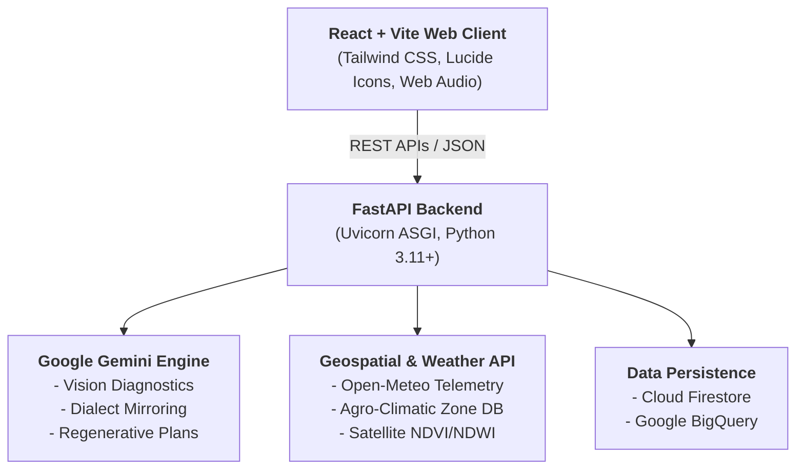

# 🌾 CropIndia: Kisan Sahayak

[](https://www.python.org/)
[](https://fastapi.tiangolo.com/)
[](https://reactjs.org/)
[](LICENSE)
[](https://github.com/psf/black)

**CropIndia: Kisan Sahayak** is an autonomous, AI-powered agronomic advisory and early-warning platform engineered specifically for Indian smallholder farmers. By fusing multimodal computer vision, soil health telemetry, geospatial weather patterns, and vernacular speech synthesis, CropIndia delivers hyper-localized, strictly regenerative, and actionable farming guidance.

---

## 📑 Table of Contents
- [Project Vision](#-project-vision)
- [Key Features](#-key-features)
- [System Architecture](#-system-architecture)
- [Technology Stack](#-technology-stack)
- [Getting Started](#-getting-started)
- [API Endpoints](#-core-api-endpoints)
- [Testing & Quality Assurance](#-testing--quality-assurance)
- [Deployment](#-deployment)
- [Contributing](#-contributing)
- [License](#-license)

---

## 🎯 Project Vision
Smallholder farmers in India face compounding challenges: unpredictable climate patterns, degrading soil health, and a reliance on expensive, synthetic chemical inputs. **Kisan Sahayak** bridges the digital divide by providing an accessible, voice-native, and scientifically grounded platform that promotes **regenerative agriculture**. We empower farmers to diagnose crop diseases instantly, restore soil biology, and make data-driven decisions using tools available in their native dialects.

---

## ✨ Key Features

- 🌿 **Multimodal Leaf Pathology & Diagnostics**: Leverages Google Gemini Vision models to accurately diagnose foliar pathogens, pest infestations, and chlorosis from smartphone photos. Outputs include symptom breakdowns, etiology, and actionable bio-remedies.
- ♻️ **Strictly Regenerative Agronomy**: Prescribes natural biological controls, bio-fungicides, and soil amendments (e.g., *Jeevamrit*, *Trichoderma harzianum*, fermented sour buttermilk, and Neem Seed Kernel Extract) over synthetic chemical inputs.
- 📊 **Soil Health Card Analysis**: Evaluates key soil metrics (Organic Carbon %, pH, texture, N-P-K) against regional agro-climatic baselines to generate customized biological restoration plans and crop rotation strategies.
- 🗣️ **Multilingual & Voice-Native Output**: Generates vernacular advisories with dialect mirroring (Hindi, Bengali, Telugu, Marathi, etc.). Every diagnosis includes a `spoken_summary` optimized for direct Text-to-Speech (TTS) playback.
- 🛰️ **Geospatial & Environmental Telemetry**: Contextualizes diagnostics using GPS coordinates, agro-climatic zone profiles, local weather history (Open-Meteo), and satellite vegetation indices (NDVI/NDWI).
- 🏗️ **CQRS Dual-Data Architecture**: Utilizes Cloud Firestore for sub-second operational state (farmer profiles, active scans) and Google BigQuery for longitudinal agronomic analytics and disease outbreak aggregation.
- 🔒 **Secure Token-Based Authentication**: Implements lightweight, cryptographically secure session authentication using Python’s `secrets` module alongside Firebase Admin SDK integration.

---

## 🏗️ System Architecture


---
## 💻 Technology Stack

| Category | Technologies |
| :--- | :--- |
| **Backend** | FastAPI, Uvicorn, Pydantic v2, Python `secrets` |
| **AI & Vision** | Google GenAI SDK (`gemini-3.7-flash` / `3.6-flash`), Pillow (PIL) |
| **Databases** | Google Cloud Firestore (Operational), Google BigQuery (Analytical) |
| **Frontend** | React 18, Vite, Tailwind CSS, Lucide React, Web Audio API |
| **External APIs** | Open-Meteo (Historical & Forecast), Satellite NDVI/NDWI feeds |
| **DevOps & Cloud** | Google Cloud Run, Docker, GitHub Actions (CI/CD) |

----------------------------------------------------------------------------------------

## 🚀 Getting Started

Follow these steps to set up the CropIndia platform locally on your machine.

### Prerequisites

Before you begin, ensure you have the following installed and configured:
- **Python 3.10** or higher ([Download](https://www.python.org/downloads/))
- **Node.js 18+** and **npm** ([Download](https://nodejs.org/))
- **Git** ([Download](https://git-scm.com/))
- A **Google Cloud Project** with the following APIs enabled:
  - [Cloud Firestore API](https://console.cloud.google.com/apis/library/firestore.googleapis.com)
  - [BigQuery API](https://console.cloud.google.com/apis/library/bigquery.googleapis.com)
  - [Gemini API](https://ai.google.dev/)
- A Firebase Service Account key (`firebase-key.json`).

---

### 1. Environment Setup

Create a `.env` file in the **root directory** of the project to store your environment variables. You can copy the contents from `.env.example` and update them:

```bash
# Google Gemini API
GEMINI_API_KEY=your_gemini_api_key_here

#### Google Cloud & Firebase Configuration
GOOGLE_CLOUD_PROJECT=cropindia-prod
FIREBASE_KEY_PATH=backend/database/credentials/firebase-key.json
# Alternative for containerized environments:
# FIREBASE_KEY_BASE64=your_base64_encoded_service_account_json

# BigQuery Analytics Settings
BIGQUERY_DATASET_ID=cropindia_analytics
BIGQUERY_DIAGNOSTICS_TABLE=leaf_diagnostics_log
BIGQUERY_SOIL_TABLE=soil_health_log

# Application Security
SECRET_KEY=generate_with_python_secrets_token_hex_32
```


---

### 2. Backend Setup

Open your terminal and run the following commands to set up the Python backend:

```bash
# 1. Clone the repository
git clone https://github.com/your-username/CropIndia.git
cd CropIndia

# 2. Create and activate a virtual environment
python -m venv venv

# On Windows (PowerShell):
.\venv\Scripts\Activate
# On Linux / macOS:
source venv/bin/activate

# 3. Install Python dependencies
pip install -r requirements.txt

# 4. Start the FastAPI development server
python -m uvicorn backend.main:app --reload --host 127.0.0.1 --port 8000
```
---
## 3.  Frontend Setup

Open a new terminal window (keep the backend running in the first one) and run the following commands to start the React frontend:

```bash
# 1. Navigate to the frontend directory
cd CropIndia/frontend

# 2. Install Node.js dependencies
npm install

# 3. Start the Vite development server
npm run dev
```
---

## 🔌 Core API Endpoints

The backend exposes a RESTful API designed for seamless integration with the React frontend and mobile clients. All endpoints (except `/health`) require a valid session token in the `Authorization` header.

| Method | Endpoint | Description |
| :--- | :--- | :--- |
| `GET` | `/health` | **System Health Check.** Verifies server status, Cloud Firestore connectivity, and BigQuery bindings. |
| `POST` | `/api/v1/diagnose` | **Leaf Pathology Diagnostics.** Accepts a multipart image upload, GPS coordinates, and language preference. Returns foliar pathology results, etiology, and bio-remedies. |
| `POST` | `/api/v1/soil/regenerative-plan` | **Soil Health Analysis.** Evaluates uploaded soil health card metrics (N-P-K, pH, Organic Carbon) and outputs a customized biological restoration plan. |
| `POST` | `/api/v1/farmer/query` | **Multimodal Farmer Assistant.** Handles natural text or audio byte queries. Performs dialect matching and returns context-aware agronomic advice. |
| `POST` | `/api/v1/translate-advisory` | **Advisory Translation.** Translates a cached diagnostic or soil advisory to a new target regional language without re-invoking the heavy vision models. |

> 💡 **Interactive Documentation:** Because the backend is built with **FastAPI**, you can explore all endpoints, view request/response schemas, and test the API directly in your browser by visiting the auto-generated Swagger UI at: 
> **[http://127.0.0.1:8000/docs](http://127.0.0.1:8000/docs)**

---


